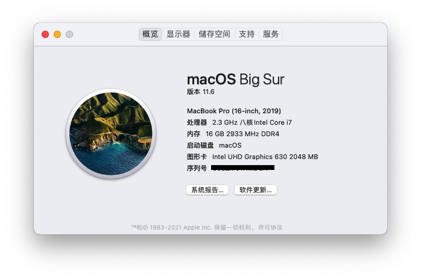

# Razer Blade 15 Advanced 2020 Hackintosh

## Intro
First of all, note that there will not be any tutorials here, but it will provide EFI and what I noticed when installing Hackintosh using OpenCore. Please refer to the configuration table below to make sure your Razer Blade configuration is the same as mine. Before using my EFI, be careful not to copy and paste directly, edit your own config.plist in advance. Back up your important data and check it step by step according to the official __[OpenCore](https://dortania.github.io/OpenCore-Install-Guide/prerequisites.html#prerequisites)__  tutorial. Good luck.

## Hardware
**Razer Blade 15 Advanced Model (Early 2020)**
|             | Description | macOS 11.6 Compatibility    |
| :---        | :---        | :---          |
| CPU     | Intel Core i7-10875H @ 2.30GHz 8 Cores| OK   |
| Memory   | 16GB Samsung DDR4 3200MHz        | OK     |
| GPU   | NVIDIA GeForce RTX 2070 Super with Max-Q Desgin (8GB / Razer USA) / Intel UHD 630        | RTX not woring, UHD630 works fine. ACPI to disable dGPU.     |
| MB   | Razer CH551 (LPC Controller - 068D)        | OK     |
| Screen   | SHARP SHP14FD LQ156M1JW18 15.6" 1920 x 1080 300Hz        | OK     |
| Storge   | Samsung SSD 970 EVO Plus 2TB        | OK     |
| Internet   | Inetl Wi-Fi 6 AX201 160MHz        | OK - Thanks to OpenIntelWireless supporting it!     |
| Sound | Realtek ALC298 | OK - Please read below |
| Webcam | Windows Hellow Built-in IR HD webcam(1MP/720P) | OK - But not support windows hello (Yup, no face ID lmao)|
| TouchPad | Precision Glass | OK |
| Keyboard | Per-key RGB Powered by Razer Chroma N-Key rollover backlit | OK - But no razer software for macOS - Backlit control works good) |
| Port | USB 3.1 | OK |
| | Thunderbolt 3 (USB-C) | OK |
| | HDMI |NO - HDMI connected directly to Nvidia GPU and will not work in macOS |
| Power | 230W Power Adapter | OK |

## About Sound
This is the problem that has bothered me for the longest time. I tried a lot of ALC Layout ID, and finally `Layout ID 47` is available on my Razer Blade. Both speakers and microphones are working. I tested the speakers with other IDs and couldn't be used. But note that this is only the case of my laptop, yours may be a little different. So if you cannot use the speaker when you set the ALC Layout ID to 47, please try: 3, 11, 13, 16, 21, 22, 28, 29, 30, 32, 47, 66, 72, 99. The detailed ALC configuration can refer to here: __[AppleALC Supported Codecs](https://github.com/acidanthera/AppleALC/wiki/Supported-codecs)__

## About macOS Monterey (12.1)
I was planning to install Monterey at the beginning, but I kept getting stuck at boot. Maybe I don’t have a suitable EFI. But when using this EFI, I recommend using **macOS Big Sur**.

## About BIOS
To be honest, I see that many other Razer Blade machines need to unlock the BIOS and change the SAC. I also tried to do it, but there is no way to unlock the System Agent Configuration on this machine. But I continued to try to install macOS, and finally succeeded. That is to say, for this machine, it does not matter if the DVMT Pre-Allocated is not adjusted to 64M.

## Conclusion
I really didn't expect that I would install macOS on my machine, just because I wanted to use xcode. Although it was a bit difficult, it was still successful and I am very satisfied. This work requires time and patience, so when you encounter any problems, it is very helpful to see OpenCore troubleshooting. Finally, although I have provided the EFI file, it does not mean that I will be responsible for your actions. If your machine has any problems or malfunctions during installation, I will not be responsible for it, so use this EFI at your own risk! Good luck, sharing your success to others may be able to help a lot!
